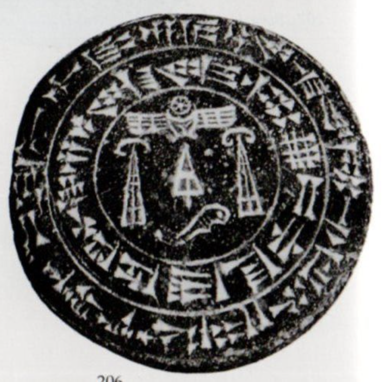
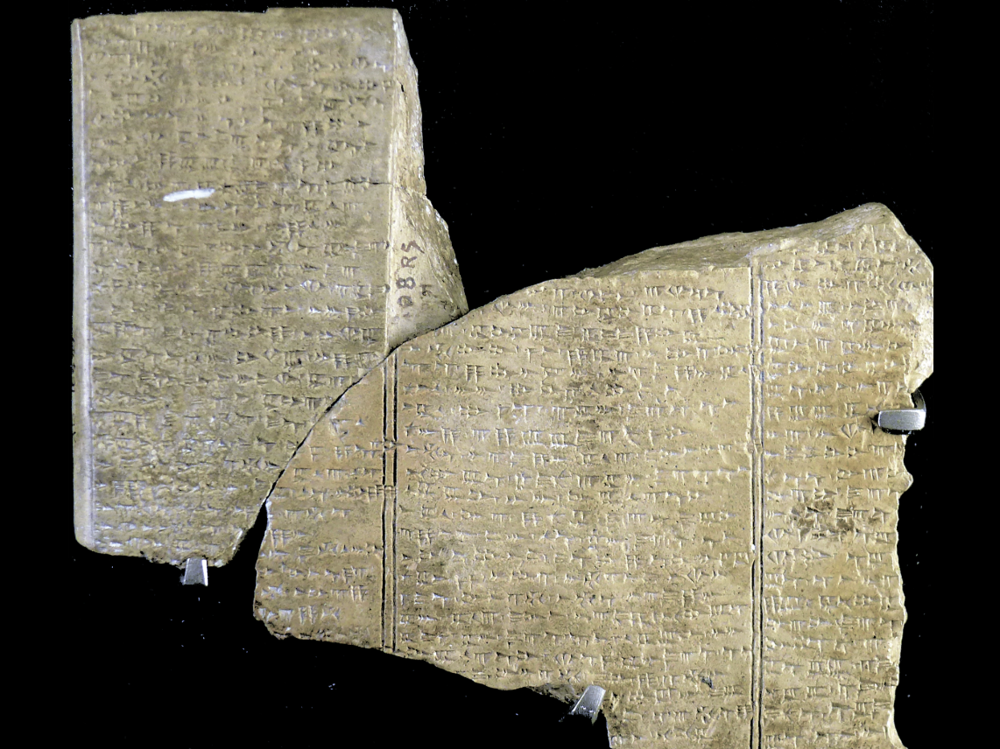
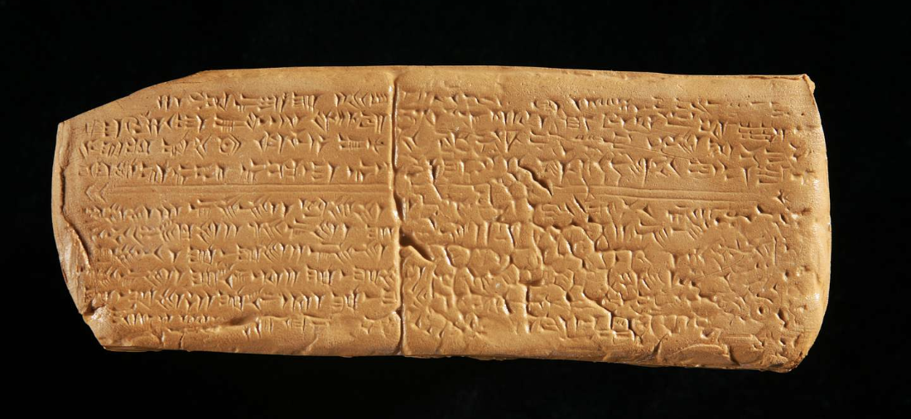
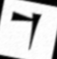
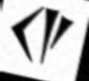

# <span style="color:#8B4513">Ugaritic Cuneiform Data Generator</span>

<div align="center">
  


  
  ### <span style="color:#CD853F">"Bridging ancient script and modern technology"</span>
  <br>
  
</div>

## <span style="color:#A0522D">🏛️ Overview</span>

This repository contains a **synthetic data generator** for **Ugaritic cuneiform** images, enabling OCR systems to transliterate this ancient script into Latin characters. This foundational work supports the **digitization** of Ugaritic tablets, critical artifacts from the 14th century BCE Near East.

> <span style="color:#996633">This project stands at the rare intersection of my two greatest passions: computer vision and ancient Near Eastern studies—a unique combination that has become my academic and personal obsession.</span>

## <span style="color:#A0522D">🌍 Why This Is Needed</span><br>
<br>
The scarcity of Ugaritic digital resources presents a **critical gap** in digital humanities:

- **Extremely rare datasets**: Unlike common scripts, Ugaritic material is virtually non-existent in machine-readable formats
- **Scholarly bottleneck**: Manual transliteration remains the primary method, limiting research scale
- **Endangered knowledge domain**: Few specialists work with these texts, risking lost interpretations
- **Missing technological bridge**: No existing OCR systems address this specific script's unique challenges

This passion project addresses an overlooked niche that mainstream digitization efforts have bypassed, preserving crucial linguistic heritage through modern technology.

## <span style="color:#A0522D">🌐 Project Goals</span>

- Generate synthetic cuneiform data for OCR training
- Apply augmentation to mimic authentic tablet variations
- Label images with accurate Latin transliterations
- Establish OCR capabilities for ancient text digitization

## <span style="color:#A0522D">🔬 Technical Approach</span>

### <span style="color:#CD853F">1. Glyph Mapping</span>
Cuneiform-to-Latin mappings in `glyphs.txt` enable properly labeled image generation

### <span style="color:#CD853F">2. Rendering Techniques</span>
Custom Ugaritic fonts simulate authentic tablet inscriptions

### <span style="color:#CD853F">3. Smart Augmentation</span>
- Rotation (±15°)
- Scale variance (90-110%)
- Translation shifts
- Simulated erosion and wear

<div align="center">
  <br>
  <i>Examples of augmentation techniques applied to glyphs</i>
</div>

## <span style="color:#A0522D">📚 Technologies</span>

```
Python 3.x | Pillow | NumPy | imgaug | OpenCV (optional)
```

## <span style="color:#A0522D">🚀 Future Directions</span>

- Develop full **OCR system** for automated transliteration
- Expand to other ancient scripts (Sumerian, Akkadian, Phoenician)
- Create comprehensive digital archives for scholars
- Build accessible tools for the small but dedicated community of Ugaritic scholars

<div align="center">
  
  <br>
  <i>Bridging my twin obsessions: computer vision algorithms and ancient Near Eastern linguistics</i>
</div>

## <span style="color:#A0522D">📊 Output Examples</span>
<div align="center">
  <p><span style="color:#CD853F">Generated samples demonstrating the variety of synthetic Ugaritic glyphs</span></p>
  <table>
    <tr>
      <td align="center">
        
        <br>
        <i>Base glyph</i>
      </td>
      <td align="center">
        
        <br>
        <i>Rotation applied</i>
      </td>
      <td align="center">
        
        <br>
        <i>Erosion simulation</i>
      </td>
    </tr>
  </table>
</div>

## <span style="color:#A0522D">⚙️ Getting Started</span>

```bash
# Clone repository
git clone https://github.com/samaltaa/UgariticGlyph_Data_Generator.git

# Install dependencies
pip install -r requirements.txt

# Generate dataset
python3 generate.py
```

## <span style="color:#A0522D">📦 Contributing</span>

Contributions welcome! Fork the repository and submit a pull request to help improve data generation or OCR capabilities.

---

<div align="center">
  <span style="color:#CD853F"><i>The past and future intertwine—one glyph at a time.</i></span>
  <br><br>
  
  <br>
  <i>Sample Ugaritic tablet with transliteration</i>
  <br><br>
  <span style="color:#996633">❝This project represents years of fascination with both computational vision algorithms and the mysteries of ancient Near Eastern languages—a personal quest to preserve humanity's linguistic heritage through code.❞</span>
</div>

<div align="center">
  <span style="color:#8B4513">Licensed under MIT</span>
</div>
